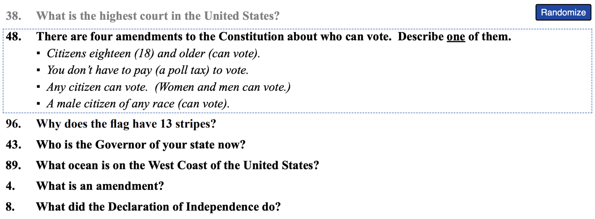

# Civic Quizzer

A simple web application to help with studying for the US Citizenship Test. The web app presents a list of all 100 questions that can be shuffled and clicked to expand/reveal answers.

The web application is available here: [civic-quizzer.pages.dev](https://civic-quizzer.pages.dev/)

## Additional resources

USCIS page to learn more: https://www.uscis.gov/citizenship/find-study-materials-and-resources/study-for-the-test
